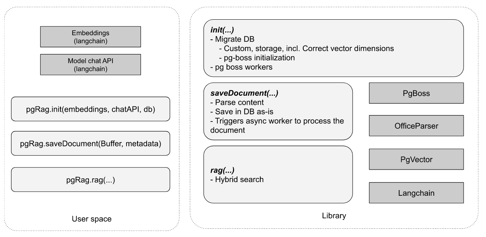

# PG RAG

A library to make building LLM based POCs fast and easy.
This library provides RAG capability for multiple file types.
If it is an office file it first converts it to pdf
It will convert the pdf to images, then GPT-4o Query it to retrieve a text version of all the data.
Then it stores the data in postgreSQL and manages the DB schema for you.
The user can then rag query, search or summarize the data.



## Usage

Install with

```sh
npm i -S @nearform/pg-rag
```

For usage see the (./docs/examples)[./docs/examples] folder

## Is PG Rag for you?

PG Rag is not meant to provide a full fledged advanced RAG for any document and be able to answer any question.

## Supported files

This library provides RAG capability for files (`.pdf`, `.ppt`/`.pptx`, `.doc`/`.docx` and text).

## Development & running tests

Pre-requisites:

- run the commands
- PostgreSQL with the pgvector extension available/installed
- Ollama running locally with `mistral` model installed
- run the following commands

```
    brew install --use-gsc graphicsmagick
    brew install ghostscript
    brew install libreoffice
```

Copy and adapt the `.env.example` file to `.env.dev` and adapt it.
Ensure your PostgreSQL database user is able to install the pgvector extension or pre-install it.

## Improvements/TODO

- Summarize documents and vectorize that
- Use Hybrid search
- Add support for labels to categorize documents
